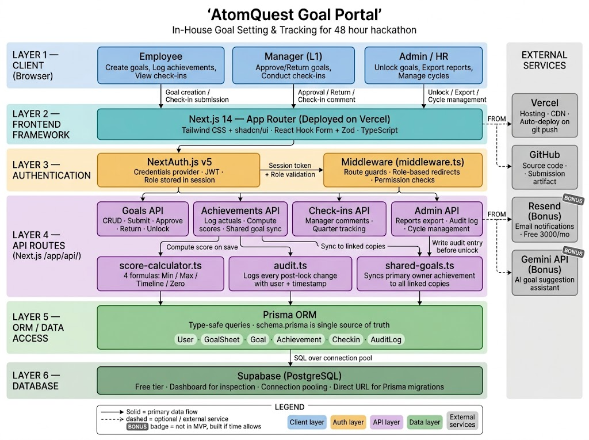

# AtomQuest Goal Portal

AtomQuest is an in-house Goal Setting and Tracking Portal built for a 48-hour hackathon. It replaces spreadsheet-driven performance management with a structured, role-based system where employees create goals, managers review and approve them, and Admin/HR oversees cycles, audit history, and reporting.

The product is designed as an enterprise SaaS experience with a refined dark UI, strong workflow controls, and clear role separation across Employee, Manager, and Admin/HR journeys.

## Problem Statement

Many organizations still manage annual goals and quarterly performance updates through spreadsheets, email threads, and manual follow-ups. That creates a few common problems:

- Goal creation is unstructured and inconsistent.
- Approval workflows are slow and hard to track.
- Locked goals can still change without visibility.
- Quarterly achievements are not centralized.
- Audit trails and exports are painful for HR teams.

AtomQuest solves this by turning goal management into a single workflow:

`Employee creates goals -> Manager approves/returns -> Goals lock -> Employee logs quarterly achievements -> Manager conducts check-ins -> Admin monitors, unlocks when needed, and exports reports`

## What The Product Does

AtomQuest supports the full goal lifecycle:

- Employees create goal sheets for the active cycle.
- Managers review, edit, approve, or return submitted goal sheets.
- Approved goals become locked.
- Employees log quarterly achievements against each goal.
- Managers add structured quarterly check-in comments.
- Admin/HR manages cycles, employee hierarchy, shared goals, audit logs, and reports.
- Optional bonus integrations support AI goal suggestions and email notifications.

## Key Highlights For Judges

- Full-stack app in a single Next.js codebase.
- Three-role workflow with role-aware dashboards and route protection.
- Business-rule-heavy implementation, not just UI screens.
- Locked goal workflow with Admin unlock and audit trail.
- Shared goals feature with linked achievement syncing.
- Quarterly check-ins and score computation across multiple UoM types.
- Export-ready reporting for Admin/HR.
- Premium, cohesive enterprise UI/UX across the entire product.

## User Roles

### Employee

- Create and edit own goal sheets while in `DRAFT` or `RETURNED`
- Submit goal sheets for approval
- View approved and locked goals
- Log quarterly achievements
- Read manager check-in comments

### Manager (L1)

- Review team submissions
- Edit targets/weightages during approval flow
- Approve and lock goal sheets
- Return goal sheets for rework with comments
- Conduct quarterly check-ins
- View team progress

### Admin / HR

- Manage goal cycles
- Manage employees, departments, and reporting lines
- Unlock locked goal sheets with reason tracking
- View complete audit trail
- Push shared goals
- Export reports

## Core Features

### 1. Goal Creation and Submission

- Dynamic goal sheet creation
- Support for multiple goal rows
- Weightage validation
- Submit only when the total equals 100%

### 2. Manager Approval Workflow

- Pending approvals queue
- Inline manager review flow
- Approve and lock
- Return with revision comment

### 3. Goal Locking + Audit Trail

- Approved goals are locked
- Admin unlock requires reason
- Audit entries store who changed what and when

### 4. Quarterly Achievement Tracking

- Employees log actuals for each quarter
- Managers add check-in comments
- Scores are computed and stored for reporting

### 5. Shared Goals

- Admin/Manager can distribute shared goals
- Shared goals preserve read-only fields for recipients
- Linked achievement updates sync to copied goals

### 6. Reporting and Export

- Admin report preview table
- CSV export
- Analytics dashboard with charts and completion views

### 7. Bonus Features

- AI-assisted goal suggestions via Gemini API
- Email notifications via Resend

## Business Rules Enforced

These rules are central to the project and are enforced in the app logic, not just the UI.

### Weightage Rules

- A goal sheet can contain up to 8 goals
- Total weightage must equal exactly `100%` before submission
- Validation is rechecked during manager approval as well

### Goal Locking Rules

- Goal sheets lock on approval
- Locked goals cannot be edited directly
- Admin unlock is required before changes can happen again
- Unlock action creates an audit log entry

### Shared Goal Rules

- Shared goals are pushed as copies
- Recipients can only adjust allowed fields
- Primary owner achievement updates sync to linked copies

### Progress Score Rules

The app supports 4 Unit of Measure types:

- `NUMERIC_MIN`: higher actual is better, score based on `actual / target`
- `NUMERIC_MAX`: lower actual is better, score based on `target / actual`
- `TIMELINE`: score based on completion vs deadline
- `ZERO`: score is `100%` when zero incidents are achieved, else `0%`

## Architecture Overview

The application follows a layered architecture that keeps concerns separated and easy to reason about.

## Architecture Diagram




### Layer 1: Client

Browser-based UI for:

- Employee
- Manager (L1)
- Admin / HR

### Layer 2: Frontend Framework

- Next.js App Router
- React
- TypeScript
- Tailwind CSS
- shadcn/ui
- React Hook Form + Zod

This layer handles the dashboards, forms, validation UX, tables, charts, and role-based navigation.

### Layer 3: Authentication

- NextAuth.js v5
- Credentials provider
- JWT session strategy
- Middleware-based route guards and redirects

This layer controls session handling and user access by role.

### Layer 4: API Routes

API routes are built inside `app/api/` and grouped by workflow:

- Goals API
- Achievements API
- Check-ins API
- Cycles API
- Employees API
- Reports API
- Shared Goals API
- Auth API
- AI Suggestions API

Supporting business logic modules:

- `lib/score-calculator.ts`
- `lib/audit.ts`
- `lib/permissions.ts`
- `lib/email.ts`

### Layer 5: ORM / Data Access

- Prisma ORM
- Type-safe database access
- Centralized schema as source of truth

### Layer 6: Database

- PostgreSQL
- Configured for Supabase in the original deployment plan

### External Services

- Vercel for hosting
- GitHub for source control and submission
- Resend for email notifications
- Gemini API for AI-assisted goal suggestion

## Tech Stack

### Frontend

- Next.js `16.2.6`
- React `19`
- TypeScript
- Tailwind CSS v4
- shadcn/ui
- Lucide icons
- Recharts

### Forms and Validation

- React Hook Form
- Zod

### Authentication

- NextAuth.js v5

### Backend / Data

- Next.js Route Handlers
- Prisma ORM
- PostgreSQL

### Utilities / Integrations

- Resend
- `xlsx`
- `csv-stringify`
- `@google/genai`

## Project Structure

```text
goal-portal/
├── app/
│   ├── (auth)/login/
│   ├── (dashboard)/
│   │   ├── admin/
│   │   ├── manager/
│   │   └── employee/
│   ├── api/
│   │   ├── auth/
│   │   ├── goals/
│   │   ├── checkins/
│   │   ├── cycles/
│   │   ├── employees/
│   │   ├── reports/
│   │   ├── shared-goals/
│   │   └── ai/
│   ├── globals.css
│   └── layout.tsx
├── components/
│   ├── admin/
│   ├── checkins/
│   ├── dashboard/
│   ├── goals/
│   ├── layout/
│   └── ui/
├── lib/
│   ├── auth.ts
│   ├── auth.config.ts
│   ├── prisma.ts
│   ├── permissions.ts
│   ├── score-calculator.ts
│   ├── audit.ts
│   ├── email.ts
│   └── validations.ts
├── prisma/
│   ├── schema.prisma
│   └── seed.ts
└── README.md
```

## Database Design

The schema is centered around the goal lifecycle.

### Main Models

- `User`
- `Department`
- `GoalCycle`
- `GoalSheet`
- `Goal`
- `Achievement`
- `Checkin`
- `AuditLog`

### Important Relationships

- A `User` belongs to a `Department`
- A `User` can report to another `User` as manager
- A `GoalSheet` belongs to an employee and a cycle
- A `GoalSheet` contains many `Goal` records
- A `Goal` contains quarterly `Achievement` entries
- A `GoalSheet` can have many manager `Checkin` comments
- Locked/unlocked changes are recorded in `AuditLog`

## Demo Credentials

Seeded demo users:

```text
Admin:    admin@atomquest.com    / Admin@123
Manager:  manager@atomquest.com  / Manager@123
Employee: employee@atomquest.com / Employee@123
```

These credentials are also used by the in-app demo role switcher.

## Local Setup

### 1. Install dependencies

```bash
npm install
```

### 2. Configure environment variables

Create `.env` inside `goal-portal/`.

Example values:

```env
DATABASE_URL=postgresql://...
DIRECT_URL=postgresql://...
NEXTAUTH_SECRET=your-random-secret
NEXTAUTH_URL=http://localhost:3000
GOOGLE_GENERATIVE_AI_API_KEY=your-key
RESEND_API_KEY=your-key
NEXT_PUBLIC_APP_URL=http://localhost:3000
```

Note:

- AI and email are bonus features
- If `RESEND_API_KEY` is not set, email functions fall back to mock logging

### 3. Generate Prisma client

```bash
npm run db:generate
```

### 4. Push schema

```bash
npm run db:push
```

### 5. Seed demo data

```bash
npm run db:seed
```

### 6. Start the app

```bash
npm run dev
```

Open:

```text
http://localhost:3000
```

## Available Scripts

```bash
npm run dev
npm run build
npm run start
npm run db:push
npm run db:generate
npm run db:seed
npm run db:studio
```

## Demo Flow For Judges

Recommended walkthrough:

1. Log in as Admin and show cycle management.
2. Show employee directory and reporting hierarchy.
3. Push a shared goal.
4. Switch to Employee and create or review a goal sheet.
5. Submit the goal sheet for approval.
6. Switch to Manager and open pending approvals.
7. Edit a target or weightage, then approve or return.
8. Switch back to Employee and log quarterly achievements.
9. Show Manager check-ins.
10. Return to Admin and open audit trail plus reports export.

This demo gives a full end-to-end view of the platform instead of isolated pages.

## UI / UX Direction

The interface was redesigned as a premium dark enterprise product.

### Design language

- Dark luxury visual system
- Violet and indigo accent palette
- Glassmorphism cards and elevated panels
- Consistent role-based navigation
- Analytics-style dashboards and tables

### UX goals

- Fast scanning for judges during demo
- Clear state transitions
- Distinct workflows for each role
- Strong visual consistency across all pages

## Security and Access Control

- Role-based route protection via middleware
- Session-based access checks
- Role-aware dashboards and navigation
- API-level permission checks
- Locked-goal protection and audit logging

## What Makes This More Than A CRUD App

- Complex workflow between 3 roles
- Strict business validation rules
- Locking and unlock controls
- Shared goal propagation logic
- Achievement score calculations
- Quarterly tracking model
- Auditability and export readiness

## Hackathon Value

AtomQuest is practical, demo-friendly, and enterprise-relevant.

It demonstrates:

- Product thinking
- Full-stack implementation
- Business-rule modeling
- Scalable architecture choices
- Polished UI/UX

## Future Improvements

If extended beyond the hackathon, the next natural steps would be:

- Excel export formatting improvements
- Reminder/escalation workflows
- Advanced analytics dashboards
- Department-level insights
- SSO integration
- Approval SLA tracking
- Notification center

## Build Status

Production build has been verified successfully with:

```bash
npm run build
```

## Submission Notes

This repository contains:

- Source code for the AtomQuest Goal Portal
- Full role-based workflows
- Prisma schema and seed data
- Bonus integrations for AI and email
- Enterprise-style UI redesign for hackathon presentation

If you are evaluating this project, the best way to understand it is to log in with each seeded role and follow the demo flow above.
